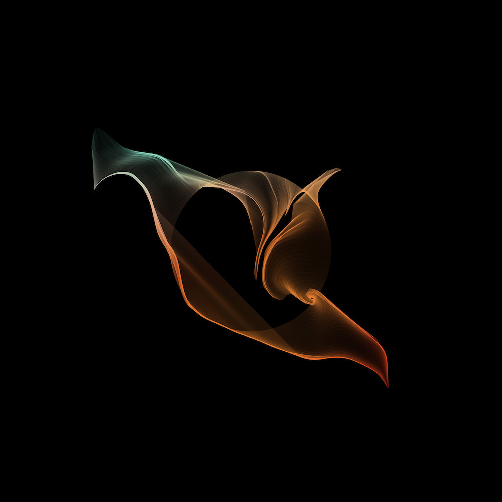

Welcome to _The Gift Of_ blog! I'm happy that you're here. I'm happy that I'm here.

I'm not entirely sure what this internet outlet will end up looking like in its future. I simply know I want a place to engage with the things I love. I want a space where I can slow my thoughts down and question myself -- too often with my work and my art, I rush to reach some end. My hope is this blog helps me look around a bit more.

Take this image for example:

I am **99%** sure that the second this piece was generated, I finished creating that day. I was probably thinking "Holy smokes, I've done _it_". Now, don't get me wrong, I love this image. It could very well be _it_. But, my desire is to really improve or change whatever instinct tells me:

> Dylan, that's a nice piece of generative art. Let's wrap it up, shut
> down the server and come back another day.

I don't think the first step is to write more code. I don't even think the first step is to run the program again and see what it can spit out next. I think it's best for me to stop coding and question the pixels on the screen.

Why does this piece work for me? Why does it calm me down when I look at it?

The first component of this piece that stands out to me is that it's a great example of my favorite concept in generative art: **controlled randomness**. Much of the generative works I've created are centered around this idea.

1.  Begin with some form or structure. In the piece above, I started with the construction of a circle: drop a particle at 0 degrees, rotate around and drop more particles along the way.
2.  Introduce randomness. Above, each particle is driven by [Perlin noise](https://en.wikipedia.org/wiki/Perlin_noise) randomness as its path is traced over time.
3.  Stop time. Watch your piece grow and evolve and freeze time when you see something interesting.

For me, this is a beautiful pattern. There's a lovely balance of control and chaos. There are elements I'm in charge of, parts I can think through and tinker with and adjust. And there are variables that I cannot control. Things beyond me.

Without getting too dramatic, those ideas extend to a broader concept of life: the balance or _imbalance_ of the decisions we make and the factors that happen unto us. My thoughts and feelings and memories and everything else _outside_ of myself.

So, why does the generative piece above calm me down? It reminds me of the tranquil moments that we can find in all of this chaos.

---

I look forward to continuing this blog. I'll be writing about generative art, software development and the ideas they contain. See you soon.
